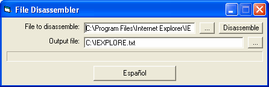



## File Disassembler

### Description

PLEASE NOTE THAT THIS IS NOT A DECOMPILER. All it does is that it converts files into ASM code. If anyone can build a decompiler that works, I'd be proud because it takes hard work to convert ASM code into VB code.

OBSERVE POR FAVOR QUE ESTO NO ES UN DECOMPILER. Todo lo que lo hace es que convierte archivos en código del ASM. Si cualquier persona puede construir un decompiler que trabaje, sería orgulloso porque toma el trabajo duro para convertir código del ASM en código de VB.
 
### More Info
 

             |
---                |---
**Submitted On**   |2004-07-28 03:00:48
**By**             |[mathXpert](https://github.com/Planet-Source-Code/PSCIndex/blob/master/ByAuthor/mathxpert.md)
**Level**          |Intermediate
**User Rating**    |2.5 (10 globes from 4 users)
**Compatibility**  |VB 6\.0
**Category**       |[Files/ File Controls/ Input/ Output](https://github.com/Planet-Source-Code/PSCIndex/blob/master/ByCategory/files-file-controls-input-output__1-3.md)
**World**          |[Visual Basic](https://github.com/Planet-Source-Code/PSCIndex/blob/master/ByWorld/visual-basic.md)
**Archive File**   |[File\_Disas1774947282004\.zip](https://github.com/Planet-Source-Code/mathxpert-file-disassembler__1-55217/archive/master.zip)

